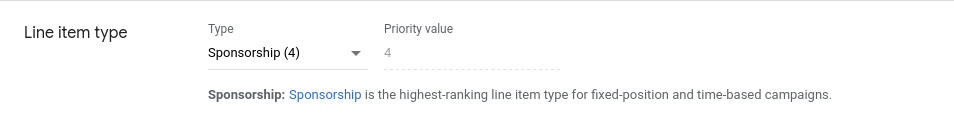
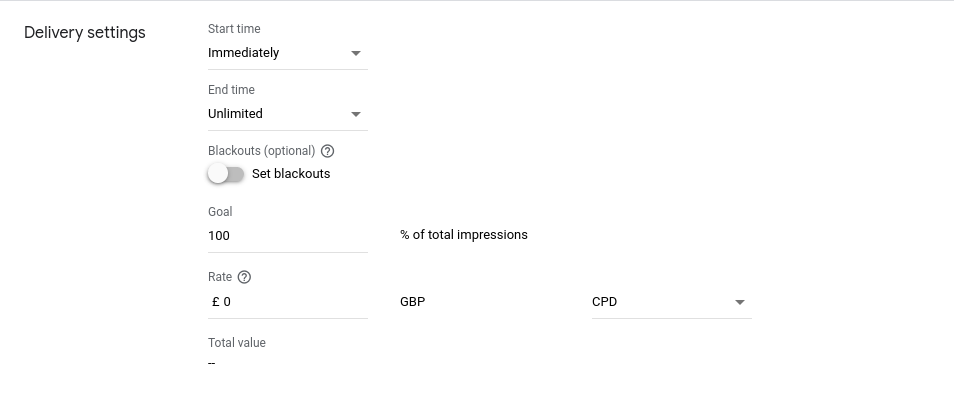
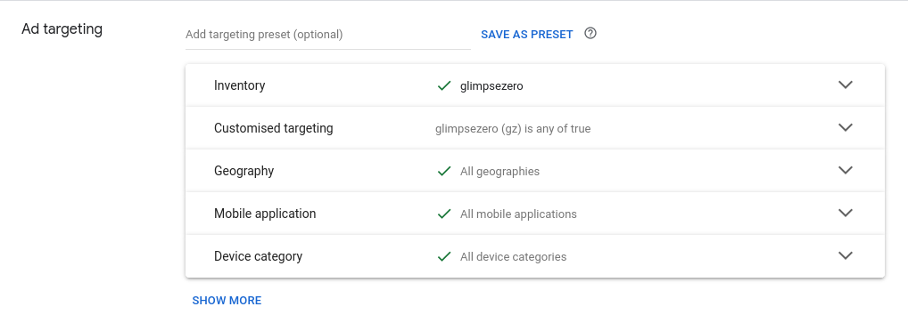

# Zerojs: integration for net-zero programmatic advertising

Zerojs is a publisher integration aimed at reducing carbon emission in the programmatic advertising process. In a conventional programmatic advertising process, to render a single ad creative an ad request will go through multiple third parties and exchanges. This process accounts for the majority of a publisher's scope 3 emission, thus finding a cleaner alternative to this process will drastically reduce a publisher's scope 3 emission.

Zerojs achieves scope 3 emission reduction by cutting off all the requests to the supply chain and intelligently route the publisher's inventory to the available buyers' campaign. Because all the intermittent requests are avoided, the result is a drastic reduction in scope 3 carbon emission and a faster page load time.

## [Zerojs API Reference](reference.md)

## GAM Setup

To enable Zeorjs integration, you need to set up line items in GAM specific to be used by Zerojs.

### 1. Add a line item

Set the line item type to  **Sponsorship** so that it takes precedence over other line item set up for open bidding.



Set goal to **100%**



Set inventory targeting to target your desired inventory. Add `gz` *is any of* `true` as customized targeting. Zerojs will send the decarbonized ad request to GAM with this key value attached.



### 2. Add a creative

Add the creatives according to the instruction provided by the buyer/agent that you struck a deal with.

### 3. Attach creative to line item

In your line item's creative tab, click *ADD CREATIVE*, choose the *Existing creative* option and add the creative you just created.

## Publisher site integration

Contact our support team to create an account for your organization. On our web portal you can register the GAM line items that are used to bypass the carbon intensive programmatic bidding process, and our ZeroJs integration will try to optimize the inventory to minimize your carbon emission.

After configuring your site's delivery setting on the web portal, you have to integrate Zerojs into your site. Here is a simple example doing that.

```html
<script async src="https://www.googletagservices.com/tag/js/gpt.js"></script>
<script async src="./prebid.js"></script>
<script async src="https://cdn.glimpsezero.io/scripts/zero.js"></script>
<script>
var googletag = window.googletag || {}
googletag.cmd = window.googletag.cmd || []
var pbjs = pbjs || {}
pbjs.que = pbjs.que || []
var zjs = window.zjs || {}
zjs.cmd = window.zjs.cmd || []

// configure page ad units
const adUnits = [
  {
    div: "unit-1",
    code: "/1234567/environment-728x90",
    sizes: [[728, 90]]
    mediaTypes: {
      banner: {
        sizes: [[728, 90]],
      },
    },
    bids: [
      {
        bidder: "glimpse",
      },
    ],
  },
  // ...
]

// register ad units with gpt
googletag.cmd.push(() => {
  adUnits.forEach(({ code, sizes, div }) => {
    googletag
      .defineSlot(code, sizes, div)
      .addService(googletag.pubads())
  })
  googletag.pubads().disableInitialLoad()
  googletag.pubads().enableSingleRequest()
  googletag.enableServices()
})

// register with zerojs
zjs.cmd.push(() => {
  zjs.setPubId("a9j3")
  // zerojs will handle the delivering of the deCarbed units
  const [unfilledUnits, deCarbedUnits] = zjs.go(adUnits)

  // proceed to open bidding with the unfilled units
  pbjs.que.push(() => {
    pbjs.addAdUnits(unfilled)
    pbjs.requestBids({
      bidsBackHandler: () => {
        pbjs.setTargetingForGPTAsync()
        googletag.pubads().refresh()
      },
      timeout: 5000,
    })
  })
})
</script>
```