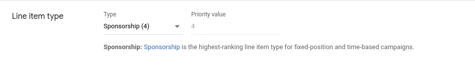
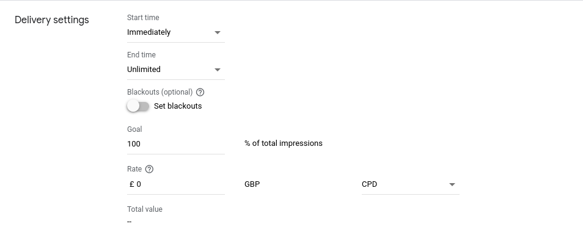
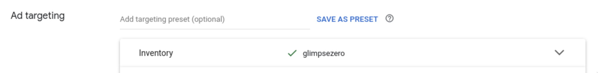
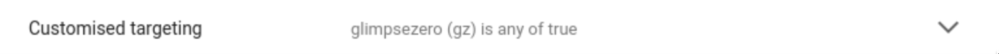

# Getting Started

## Prerequisites

1. A [Google Ad Manager](https://admanager.google.com/intl/en_uk/home/) account
1. A working understanding of Google Ad Manager (their [Ad selection whitepaper](https://support.google.com/admanager/answer/1143651?hl=en) is a good place to start)
1. A working understanding of [Google Publisher Tag](https://developers.google.com/publisher-tag/guides/get-started)
1. A working understanding of your site's header bidding configuration (ie [Prebid.js](https://docs.prebid.org/), [APS](https://aps.amazon.com/aps/index.html), etc)
1. A Glimpse Zero account ([contact us if you don't have one](mailto:support@glimpsezero.io))

## Basic setup

There are three steps to get up and running:

1. Integrating our library on your page (only done once)
1. Setting up your Sponsorship Line Item in GAM (done for each Sponsorship)
1. Setting up targetting in Glimpse Zero (done for each Sponsorship)

### Page integration

1. Include the zero.js tag in `<head>` tags:

  ```html
  <script async src="https://cdn.glimpsezero.io/scripts/zero.js"></script>
  ```

  > ℹ️ You can fix the zero.js library to a specific version by appending the SEMVER to src url: `zero-1.0.1.js`. Alternatively if you use `zero.js` the latest version is used.

1. Initialised the zero.js command queue:

  ```ts
  var zjs = window.zjs || {}
  zjs.cmd = window.zjs.cmd || []
  ```

1. Set your 4 character publisher id:

  ```ts
  zjs.setPubId("a9j3")
  ```

1. Finally run the prematch process and pass the unmatched ad units to your header bidding setup:

  ```ts
  const adUnits = [ /* ... */ ]
  const [unmatched, matched] = zjs.prematch(adUnits)
  runHeaderBidding(unmatched)
  ```

Bringing this all together we get:

```html
<script async src="https://www.googletagservices.com/tag/js/gpt.js"></script>
<script async src="https://publisher.com/scripts/prebid.js"></script>
<script async src="https://cdn.glimpsezero.io/scripts/zero.js"></script>
<script>
  const adUnits = [
    {
      div: "unit-1",
      code: "/1234567/environment-728x90",
      sizes: [[728, 90]]
      mediaTypes: {
        banner: {
          sizes: [[728, 90]],
        },
      },
      bids: [
        {
          bidder: "glimpse",
        },
      ],
    },
    // ...
  ]

  // Setup Glimpse Zero
  var zjs = window.zjs || {}
  zjs.cmd = window.zjs.cmd || []

  zjs.cmd.push(() => {
    zjs.setPubId("a9j3")
    const [unmatched, matched] = zjs.go(adUnits)
    runHeaderBidding(unmatched)
  })

  // Setup Google Publisher Tag
  var googletag = window.googletag || {}
  googletag.cmd = window.googletag.cmd || []

  googletag.cmd.push(() => {
    adUnits.forEach(({ code, sizes, div }) => {
      googletag
        .defineSlot(code, sizes, div)
        .addService(googletag.pubads())
    })
    googletag.pubads().disableInitialLoad()
    googletag.pubads().enableSingleRequest()
    googletag.enableServices()
  })

  function runHeaderBidding(units) {
    // Header bidding logic
  }
</script>
```

> ℹ️ There are lots of valid ways to configure your ad stack; the setup above is for demonstration purposes.

### Google Ad Manager

In the interest of brevity this walkthrough overlooks many values you'll want to set in practice: rate, frequency capping, etc.

1. Create a **Sponsorship** line item to prematch.

  

1. Set it's goal to **100%**.

  

1. Set inventory targeting to target your desired inventory.

  

1. Target a custom key value to represent when this line item should fire. For example below we're activating this line item when the key `gz` is present with a value of `true`.

  

1. Add creatives to your line item to match your inventory.

1. Enable your line item.

### Glimpse Zero Portal

Our self-service portal and automatic GAM syncing isn't ready for prime time yet. So for now you'll need to provide us with your **Sponsorship** details so we can load it into our system. Generally we'll need to know:

- When it starts and ends
- Blackout or day parting details
- Frequency capping details
- What slots it targets
- What custom targeting key value you've used

### Testing

And that's it 🥳 However, just to be safe it's always a good idea to test. It may take a few minutes for the line item to go live. Once it does you can enable debugging by running `localStorage.debug="glimpse*"` and should see the following process on a page:

1. On the first load zero.js realises it has no targeting loaded and passes all units through to your `runActions` setup.
2. In the background zero.js will fetch targeting information from our servers and save it to the local storage key `gp_zjs_config`.
3. On a subsequent load zero.js will divide your units into matched and unmatched. It will tag matched units with the provided key values and pass the unmatched units, if any, through to `runAuctions`.
4. When runActions completes GPT will tag slots and send an add call to Google Ad Manager.
5. The response should have your Sponsorship line item against the matched slot and the other line items should fire as you would expect them to (for example triggering a Prebid line item).

If you have any issues reachout to [support@glimpsezero.io](mailto:support@glimpsezero.io).

## What next?

[👈 Back (introduction)](./introduction.md) | [Next (reference) 👉](./reference.md)
