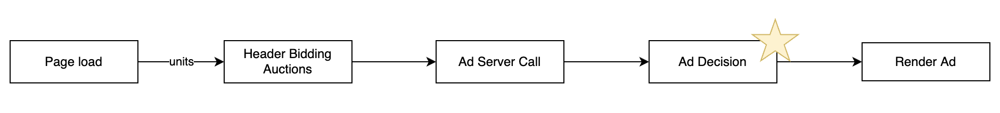
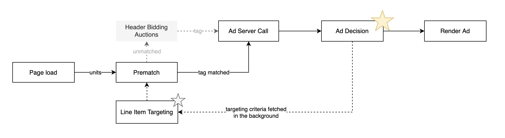

# Introduction

> ℹ️ These docs are written for engineers and ad ops professionals looking to integrate zero.js in their site.

## Background

The programmatic advertising system emits worrying amounts of CO2. In the worst cases, delivering a single impression involves the processing, storing and transmitting of data across hundreds of nodes. The result of this noisy system is that a single impression can emit over 1 gram of carbon dioxide. It so inefficient that digital advertising accounts for 10% of all Internet CO2 emissions, and in turn, the Internet accounts for 2% of global emissions 🤯

> ℹ️ Programmatic advertising falls into an Advertiser's *scope 3* (supply chain) emissions and so they must reduce these emissions to meet net zero targets (offsetting is insufficient).

The Glimpse Zero system enables publishers to make their inventory available in a carbon efficient manner. This inventory is called a Green Media Product. In the next section we'll provide an overview for how we do this.

## Ad decisioning process

The ad server decides which creative to serve after all bids are received and a call is made to the publisher's ad server. We call this a *postmatch*. A consequence of postmatching is that when certain types of campaign run (like Sponsorships) the ad server discards all client-side bids to (rightly) prioritise the Sponsorship deal.

*Fig 1. An overview of a postmatch ad decision process*

To illustrate how Glimpse Zero differs we enable a client-side *prematch* process. For example, consider a Sponsorship line item with the following configuration:

- runs on Wednesdays for 4 weeks
- runs from 0800 - 1800
- targets devices in a specific region
- only delivers once per user per day
- targeting 100% of eligible impressions

Our client-side library, zero.js, brings targeting criteria into the browser to prematch ad units and divide them into matched and unmatched groups when it makes sense to do so. Unmatched units are passed through to the publisher's existing header bidding calls while matched units are removed.

*Fig 2. Bringing prematched ad decisioning to the client*

This approach reduces CO2, improves page performance and has no impact to publisher revenue 🥳

## Features

1. **Prematching is non-blocking**. We understand that page performance directly impacts yield and so zero.js' prematching process does not make any blocking function calls (ie no network or long running calls).

2. **Line item synchronisation engine**. To ensure #1, zero.js runs a background process to synchronise targeting criteria and saves it into local storage. So that when #1 runs it can do so without impacting your page load.

3. **CO2e reporting**. Glimpse Zero provides carbon emission reporting against all matched and unmatched impressions enabling advertisers to account for their scope 3 emissions.

4. **Google Ad Manager automatic synchronisation**. 🚧 This feature is in alpha 🚧 To make setup straightforward your Glimpse Zero account can be linked to your GAM account to automatically synchronise targeting with no publisher action.

## What next?

Keep reading to get started.

[👈 Back (home)](../README.md) | [Next (getting started) 👉](./getting-started.md)